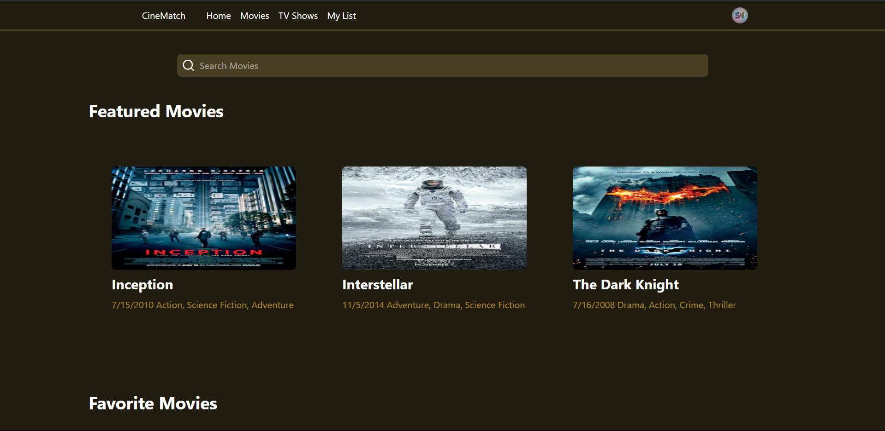
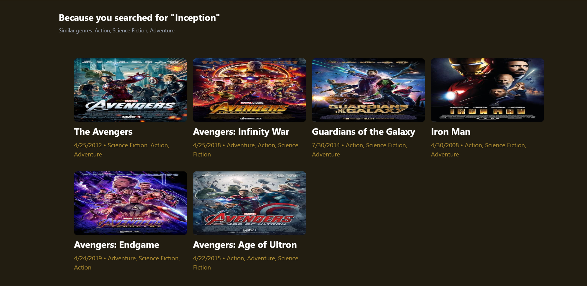
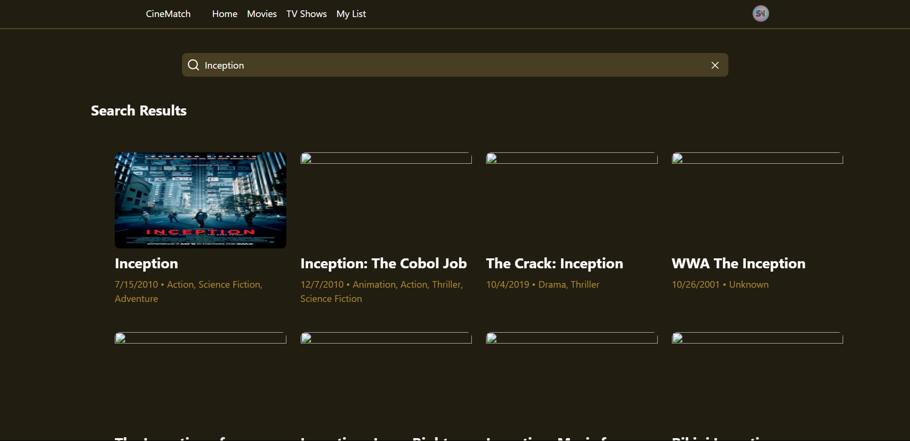

# 🎬 Movie Recommendation System

A full-stack **Movie Recommendation Web App** built with the **MERN stack**, styled using **Tailwind CSS**, and powered by basic **Natural Language Processing** via `natural`.  
It provides intelligent movie suggestions based on keywords, similarity analysis, and user interaction — all wrapped in a fast, minimalist interface.

---

## 🌟 Features

- 🔍 **Smart Movie Recommendations** using TF-IDF and NLP
- 🔁 Dynamic Search by Title / Genre / Keywords
- 🧠 Keyword-based Similarity Matching (with `natural`)
- 🎨 Beautiful & Responsive UI with React + Tailwind
- 📂 Movie Data Stored in MongoDB
- 🔄 Client-side Routing via React Router
- 💡 Built for learning + experimentation — no auth/login

---

## 🛠️ Tech Stack

| Frontend | Backend | NLP Engine | Styling |
|----------|---------|------------|---------|
| React.js | Node.js | `natural` | Tailwind CSS |
| Axios    | Express | Tokenizer | Custom Components |
| React Router | MongoDB | TF-IDF, Stemming | Utility-first CSS |

---

## 📸 Screenshots

### 🏠 Home Page


### 🎯 Recommendation Output



### 🎯 Search Results Output

---

## 🚀 Getting Started

### 1. Clone the Repo

```bash
git clone https://github.com/yourusername/movie-recommendation-app.git
cd movie
```

### 2. Setup Backend

```bash
cd Backend
npm install
npm run dev
```

> ⚠️ Make sure MongoDB is running locally or update your `.env` with a proper connection string.

### 3. Setup Frontend

```bash
cd Frontend
npm install
npm start
```

> The app will be running at `http://localhost:3000`

---

## 📂 Folder Structure

```
movie-recommendation-app/
│
├── client/          # React frontend
│   ├── components/  # Reusable UI components
│   └── pages/       # Route-based pages
│
├── server/          # Express backend
│   ├── routes/      # API endpoints
│   ├── models/      # Mongoose schemas
│   └── logic/       # NLP & recommendation logic
│
└── README.md
```

---

## 🧠 How Recommendations Work

- User enters a keyword (e.g. "sci-fi", "time travel")
- App processes the keyword using `natural`:
  - Tokenization
  - Stopword removal
  - Stemming
  - TF-IDF vector comparison with movie descriptions
- Top matching movies are sorted and returned

---

## 📦 Key Dependencies

```bash
# Frontend
react react-router-dom axios tailwindcss

# Backend
express mongoose cors dotenv

# NLP
natural
```

---

## 🤝 Contributions

Got a better recommendation algorithm? Want to improve UI/UX or add filters?  
Pull requests and forks are welcome. Let’s build smarter systems together.


